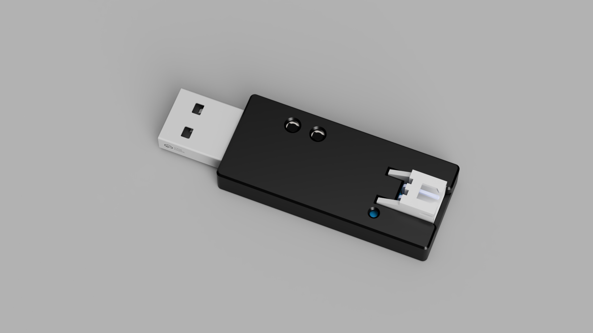

# PiCAN
[YouTube Video](https://youtu.be/SH-faxCCbi8)

A compact, USB drive shaped USB to CAN adapter, primarily intended for 3D printers running Klipper firmware.

## Purchasing a PiCAN
- [Isik's Tech Official Store](https://store.isiks.tech/products/pican-usb-to-can-bus-adapter)
- [Resellers](https://docs.isiks.tech/pican/manual/#resellers)

## Documentation
For firmware flashing, wiring, and Klipper CAN setup, see the [PiCAN manual](https://docs.isiks.tech/pican/manual/).

## Notes
- Readme files in this repo may contain Amazon Associate, Aliexpress affiliate, PCBWay affiliate links. I make a comission on qualifying purchases.
- This project does not come with any warranty, if you choose to build/use a PCB manufactured using published files in this repository, you are doing this at your own risk!
- If you want to sell PCBs manufactured using published files in this repository, you are allowed to, and you will not owe me any royalties. **You cannot claim that I endorse the sale**. You can check the license file for more information. However, if you **wish** to give me a share you can sponsor me on [GitHub](https://github.com/sponsors/xbst), subscribe on [Patreon](https://l.isiks.tech/patreon) or [YouTube](https://l.isiks.tech/member).
