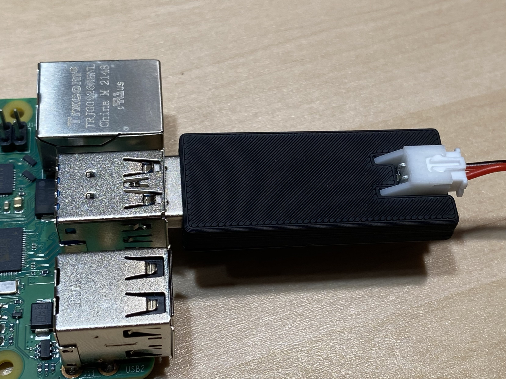

# PiCAN
[YouTube Video](https://youtu.be/SH-faxCCbi8)

A compact, USB drive shaped USB to CAN adapter, primarily intended for 3D printers running Klipper firmware.

## Purchasing a PiCAN
### United States
- [Amazon - Prime Shipping](https://www.amazon.com/dp/B0CGLC87S5)
- [Isik's Tech Store](https://store.isiks.tech/products/pican-usb-to-can-bus-adapter)
- [eBay](https://www.ebay.com/itm/155656627545)
- [XR Bunker](https://xrbunker.works/products/pican-by-xbst_isik)
### Canada
- [Amazon - Ships from the US](https://www.amazon.ca/dp/B0CGLC87S5)
### European Union
- [Lab4450 - Portugal](https://lab4450.com/product/pican-usb-to-can-adapter/)
### Australia
- [Unique Prints](https://uniqueprints.shop/shop/electronics-electrical/pcb/pican-usb-to-can-adaptor-for-klipper/)

This project is licensed under [GPL v3](./LICENSE), meaning vendors are allowed to sell PiCAN PCBs without paying me. If you'd like to support the development of this and future projects please consider [sponsoring](https://github.com/sponsors/xbst) me on GitHub. You can also subscribe on [Patreon](https://l.isiks.tech/patreon) or [YouTube](https://l.isiks.tech/member).

You can also use the included gerber files to order your own from a PCB manufacturer like [PCBWay](https://www.pcbway.com/setinvite.aspx?inviteid=374841) or [JLCPCB](https://jlcpcb.com/).
 

## Instructions
Depending on how you sourced your PiCAN, your PiCAN might already have the firmware pre-flashed (units sold by me are pre-flashed). If yours doesn't have the firmware or if you need/want to reflash it, you can follow the instructions below. 

  
Firmware Flashing

1. Download the [firmware](https://github.com/bigtreetech/U2C/blob/master/firmware/U2C_V1_STM32F072.bin).
2. Connect the PiCAN to your PC while holding down the BOOT button on the PiCAN.
3. Download and install [STM32Cube Programmer](https://www.st.com/en/development-tools/stm32cubeprog.html). (Do not download the latest version, it is buggy)
4. Select `USB` on the selecor in top right of the program (below `Not connected`). Click the refresh button next to the port selector. Select `USB1` and click connect.
5. Click `+` next to `Device Memory`, and select `Open File`. Select the downloaded firmware file. Click `Download`. Firmware will be flashed.

For Klipper CAN instructions, follow [the official Klipper docs](https://www.klipper3d.org/CANBUS.html).

**Make sure your Raspberry Pi and your CAN devices have the GNDs connected. If they are powered from the same source, they should already be connected. If unsure use your multimeter's continuity mode to test.**

## YouTube

I am a YouTube content creator. If you want content about this project & more, please consider [subscribing to my YouTube channel](https://www.youtube.com/channel/UClAWYmCkHjsbaX9Wz1df2mg).
 

If you feel like contributing to the development of this project and other projects like this you can sponsor me on [GitHub](https://github.com/sponsors/xbst), subscribe on [Patreon](https://l.isiks.tech/patreon) or [YouTube](https://l.isiks.tech/member).

## Notes
- Readme files in this repo may contain Amazon Associate, Aliexpress affiliate, PCBWay affiliate links. I make a comission on qualifying purchases.
- This project does not come with any warranty, if you choose to build/use a PCB manufactured using published files in this repository, you are doing this at your own risk!
- If you want to sell PCBs manufactured using published files in this repository, you are allowed to, and you will not owe me any royalties. **You cannot claim that I endorse the sale**. You can check the license file for more information. However, if you **wish** to give me a share you can sponsor me on [GitHub](https://github.com/sponsors/xbst), subscribe on [Patreon](https://l.isiks.tech/patreon) or [YouTube](https://l.isiks.tech/member).
